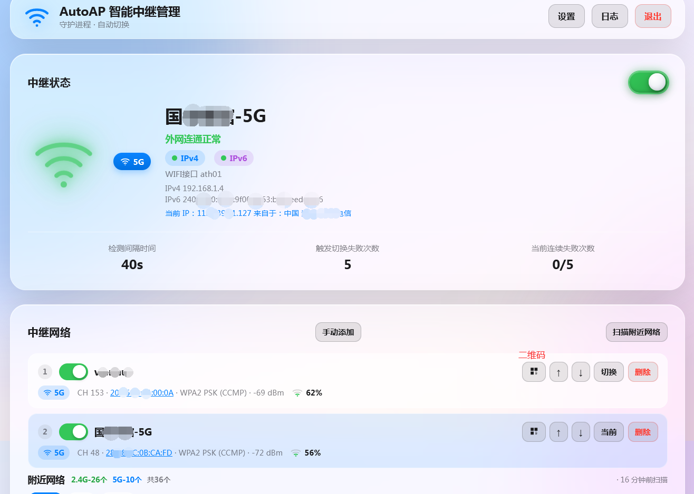
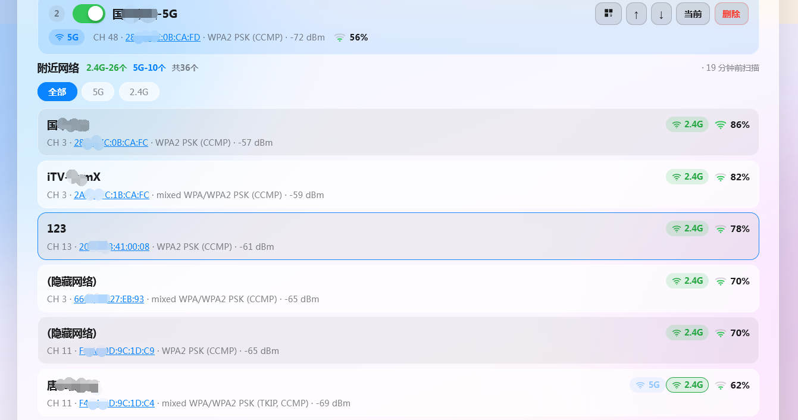
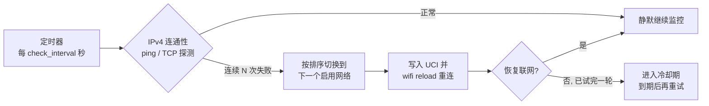

<div align="center">

# 📶 AutoAP 智能中继管理

**OpenWrt 无线中继自动切换 · 单文件静态二进制 · 内置 Web 管理界面**

*让路由器像手机一样记住并自动切换周边的 Wi-Fi 热点*

[](https://github.com/lmq8267/autoap/releases)
[](https://github.com/lmq8267/autoap/releases)
[](https://github.com/lmq8267/autoap/stargazers)
[](https://openwrt.org)
[](https://github.com/lmq8267/autoap/releases)

[⬇️ 下载最新版](https://github.com/lmq8267/autoap/releases) · [📖 使用说明](README.md#-使用方法) · [🐛 问题反馈](https://github.com/lmq8267/autoap/issues)

</div>

---

## 🧭 快捷跳转

| | | |
|:---:|:---:|:---:|
| [✨ 功能特性](#-功能特性) | [📸 界面预览](#-界面预览) | [⚙️ 工作原理](#️-工作原理) |
| [🖥️ 会执行的命令](#️-会执行哪些命令) | [🚀 使用方法](#-使用方法) | [📦 OpenWrt 部署](#-openwrt-详细部署步骤) |
| [🔁 开机自启动](#-开机自启动procd) | [❓ 常见问题](#-常见问题-faq) | [🐛 问题反馈](#-问题反馈) |

---

## ✨ 功能特性

- 🔁 **多热点记忆与自动切换** — 最多保存 **64 个**中继网络，按用户排序依次切换；断网后连续失败达到阈值即自动切到下一个可用网络
- 🌐 **双栈连通性检测** — 分别探测 IPv4 / IPv6；ICMP ping 失败时自动降级为 TCP 443 / 80 探测兜底，避免"有网被误判断网"
- ❄️ **切换冷却机制** — 所有启用网络按序试过一轮仍全部失败后进入冷却期（默认 10 分钟），防止持续断网时反复重启无线刷日志
- 🔍 **一键扫描周边 Wi-Fi** — 启动即预扫描并缓存结果，打开页面秒出列表；支持 2.4G / 5G / 6G 全频段识别
- 🌍 **出口公网 IP 显示** — 由路由器自身获取出口 IP，结果缓存后提供给页面；未匹配到合法结果时不显示
- 🛡️ **MAC 地址伪装** — 支持按品牌生成固定 / 随机 MAC（如把中继请求伪装成小米、华为设备），应对上游热点拉黑限制（部分系统可能会导致wifi无法正常使用，建议保持默认）
- 🧩 **全自动配置自举** — 中继接口、上行 `wwan` 网络、防火墙 WAN 区成员全部自动创建与校正，无需手工改 UCI
- 📱 **iOS 风格 Web 界面** — 毛玻璃卡片设计，自适应深色模式，手机平板电脑均可直接管理
- 🔐 **登录保护** — Token 会话（HttpOnly Cookie）+ 密码错误次数拉黑 IP + 请求体大小限制
- 📜 **运行日志** — 内存环形缓冲保存最近 200 条检测 / 切换日志，页面实时查看，可选落盘到文件或系统日志
- 🚀 **零外部运行库** — 静态编译为单文件，不依赖动态库；使用 OpenWrt 自带的 `uci`、`iwinfo`、`ping`、`logger` 等系统命令

## 📸 界面预览

<div align="center">



*主页：实时状态卡片 · 扫描列表 · 一键连接*



*主页：已保存的中继网络 · 检测参数设置 · 运行日志*

</div>

---

## ⚙️ 工作原理

程序是一个**常驻后台的 HTTP 服务 + 守护线程**，整体工作流程如下：



1. **识别硬件拓扑** — 启动时通过 `iwinfo` / `uci` 自动识别各频段无线网卡与可用的 STA（客户端）接口，结果缓存落盘，下次启动走快路径；
2. **定时连通性检测** — 守护线程每隔 *check_interval* 秒对配置的探测点列表（默认百度 / 1.1.1.1 / 114DNS）做 ICMP 检测，失败再尝试 TCP 443/80 连接兜底；
3. **触发条件** — IPv4 **连续失败 *switch_fail_count* 次**才判定断网（单次抖动不切换）；
4. **有序切换** — 按"当前序号的下一个启用网络"顺序轮转，绝不随机乱跳；一轮全失败则冷却，防止风暴式重启无线；
5. **状态上报** — Web 界面每 5 秒轮询 `/api/status`，展示当前 SSID、频段、信号强度、中继接口 IP、出口公网 IP、连通状态与倒计时等；公网 IP 由程序缓存，不会随每次状态轮询重复请求。

### 🖥️ 会执行哪些命令

程序所有底层操作都通过调用 OpenWrt 标准命令完成，**不改动任何无关配置**：

| 场景 | 典型命令 | 说明 |
|---|---|---|
| 无线硬件识别 | `iwinfo <接口> info`<br>`uci show wireless` | 识别各频段网卡、信道、STA 接口 |
| 扫描周边 Wi-Fi | `iwinfo <接口> scan` | 获取附近热点的 SSID / 加密方式 / 信号 |
| 连通性检测 | `ping -4 -c 1 -W 2 www.baidu.com`<br>`ping6 -c 1 -W 2 2400:3200::1` | ICMP 失败自动改用内置 TCP 443/80 探测 |
| 写入中继配置 | `uci set wireless.autoap_relay.ssid='…'`<br>`uci commit wireless`<br>`wifi reload` | 只写入固定命名段 `autoap_relay`，不碰其它无线段 |
| 创建上行接口 | `uci set network.wwan.proto='dhcp'`<br>`ifup wwan` | 复用已有 `wwan` / `wwan6`，没有则自动新建专属段 |
| 防火墙合并wan区域 | `uci add_list firewall.@zone[x].network='wwan'`<br>`/etc/init.d/firewall reload` | 自动把上行接口加入 wan 区，开箱即通 |
| MAC 伪装 | `uci set network.wwan.macaddr='XX:XX:…'` | 对上游热点呈现品牌固定 / 随机 MAC，默认模式恢复物理地址 |
| 中继总开关 | `uci delete wireless.autoap_relay.disabled`<br>`uci set wireless.autoap_relay.disabled='1'` | 开关状态同步到 UCI，异常断电重启后状态一致 |

> 🛡️ **安全细节**：所有来自网页的输入（SSID、密码等）写入命令前均经过单引号转义防注入；每次修改仅在 `uci changes` 存在暂存变更时才提交，避免无谓写盘。

---

## 🚀 使用方法

### 命令行参数

```text
用法: autoap [选项]
  -p <端口>   主页监听端口（默认 12567）
  -c <文件>   配置文件路径（默认 /etc/autoap/config.json）
  -r <文件>   日志实时输出到指定文件；默认输出到系统日志（logread 可查）
  -v          显示版本
  -h          显示帮助
```

> ⚠️ 启动时会检查 `uci` 与 `iwinfo` 是否可用，缺失则拒绝启动并提示。

### 运行示例

```sh
# 最简启动（端口 12567，配置 /etc/autoap/config.json）
/usr/bin/autoap

# 自定义端口 8080，前台调试运行
/usr/bin/autoap -p 8080

# 指定配置文件与日志文件
/usr/bin/autoap -c /etc/autoap/config.json -r /tmp/autoap.log

# 后台常驻 + 日志落盘（配合 init.d 见下文）
/usr/bin/autoap -r /var/log/autoap.log >/dev/null 2>&1 &

# 查看版本
/usr/bin/autoap -v
```

### 配置文件说明

首次启动会自动生成 `/etc/autoap/config.json`，也可参考 [`config.json.example`](config.json.example) 手动准备：

| 字段 | 默认值 | 说明 |
|---|---|---|
| `port` | `12567` | 监听端口（`-p` 参数优先级更高） |
| `password` | `admin` | 登录密码，**部署后请立即在网页里修改** |
| `check_interval` | `40` | 连通性检测间隔（秒），范围 5–3600 |
| `switch_fail_count` | `5` | 连续失败多少次触发自动切换，范围 1–10 |
| `cooldown_sec` | `600` | 一轮切换全失败后的冷却时长（秒），范围 60–86400 |
| `ping_hosts` | 百度 等 | IPv4 探测点列表，可添加经过测试ping的站点 |
| `ping_hosts6` | 阿里 2400:3200::1 等 | IPv6 探测点列表 |
| `token_ttl` | `3600` | 登录会话有效期（秒），范围 60–604800 |
| `max_fail` / `block_minutes` | `3` / `30` | 密码错误次数上限 / 拉黑时长（分钟） |
| `networks[]` | 空 | 已保存的中继网络（SSID / 密码 / 加密 / 频段 / 启用 / MAC 伪装模式） |

### 网页操作流程

1. 浏览器打开 `http://<路由器IP>:12567/`，输入密码登录（默认 `admin`）；
2. 点击 **扫描**，从列表中选择目标热点 → 输入密码 → **连接**；
3. 打开 **中继总开关**，此后守护线程自动值守；
4. 在 **设置** 里调整检测间隔、失败阈值、冷却时长与探测点；
5. 多个热点重复"扫描→连接"，程序会自动记忆进列表并在断网时按序轮换。

### API 一览（供二次开发）

| 方法 | 路径 | 说明 |
|---|---|---|
| POST | `/api/login` | 登录，成功后 Set-Cookie |
| GET | `/api/status` | 实时状态（SSID / 信号 / 连通性 / 冷却倒计时…） |
| POST | `/api/scan` · GET `/api/scancache` | 触发扫描 / 读取最近扫描缓存 |
| POST | `/api/save` | 新增 / 更新 / 删除已保存网络 |
| POST | `/api/switch` | 手动切换到指定序号网络 |
| POST | `/api/relay` | 中继总开关 `enabled=0/1` |
| POST | `/api/config` | 更新检测间隔 / 失败阈值 / 冷却 / 探测点 |
| POST | `/api/password` | 修改登录密码 |
| GET | `/api/log?lines=N` · POST `/api/log_clear` | 读取 / 清空运行日志 |

除登录外全部需要携带登录后发放的 Cookie。

---

## 📦 OpenWrt 详细部署步骤

### 第 1 步：确认依赖与架构

SSH 登录路由器后执行：

```sh
uname -m                 # 查看 CPU 架构
command -v uci iwinfo    # 确认两个依赖命令存在（OpenWrt 一般自带）
opkg update && opkg install uci iwinfo   # 缺什么装什么
```

架构与下载文件的对应关系：

| `uname -m` 输出 | 下载文件名 |
|---|---|
| `aarch64` | `autoap-aarch64-linux-musl` |
| `x86_64` | `autoap-x86_64-linux-musl` |
| `i386` / `i686` / `x86` | `autoap-i686-linux-musl` |
| `armv7l`（硬浮点） | `autoap-armv7-linux-musleabihf` |
| `armv7`（软浮点） | `autoap-armv7-linux-musleabi` |
| `mips`（小端，如 MT76xx） | `autoap-mipsel-linux-muslsf` |
| `mips`（大端） | `autoap-mips-linux-muslsf` |

> 其余架构请到 [Releases 页面](https://github.com/lmq8267/autoap/releases) 以实际资产为准。

### 第 2 步：下载二进制

**方式 A — 路由器直接下载**（推荐）：以aarch64架构示例

```sh
cd /tmp
wget --no-check-certificate https://github.com/lmq8267/autoap/releases/latest/download/autoap-aarch64-linux-musl -O autoap
```

或使用`curl`

```sh
cd /tmp
curl -Lko autoap https://github.com/lmq8267/autoap/releases/latest/download/autoap-aarch64-linux-musl
```

> 请把 URL 中的 `autoap-aarch64-linux-musl` 替换成上表对应的文件名。

**方式 B — 电脑下载后上传**：

```sh
# 在电脑上执行（Windows 用 WinSCP 拖拽亦可）
scp autoap-aarch64-linux-musl root@192.168.1.1:/tmp/autoap
```

### 第 3 步：安装

```sh
mkdir -p /etc/autoap
install -m 0755 /tmp/autoap /usr/bin/autoap
/usr/bin/autoap -v       # 能打印版本号即为安装成功
```

### 第 4 步：试运行

```sh
/usr/bin/autoap
```

看到类似以下输出即启动成功：

```text
AutoAP 智能中继管理 v1.0.0
服务端口   12567
配置文件   /etc/autoap/config.json
管理地址   http://<路由器IP>:12567/  默认登录密码 admin
```

浏览器访问 `http://<路由器IP>:12567/`，用默认密码 `admin` 登录，
**立即在右上角修改密码**，然后按上文"网页操作流程"扫描并连接热点。

确认工作正常后 `Ctrl+C` 停止，转入下一步配置自启动。

### 第 5 步：配置防火墙（仅限跨网段访问）

LAN 口访问默认放行，无需任何配置。若需从 WAN 口或其它 VLAN 访问管理页：

```sh
# 放行指定来源访问 12567 端口（示例：允许 lan 区域，一般已默认）
uci add firewall rule
uci set firewall.@rule[-1].name='Allow-AutoAP'
uci set firewall.@rule[-1].src='lan'
uci set firewall.@rule[-1].dest_port='12567'
uci set firewall.@rule[-1].proto='tcp'
uci set firewall.@rule[-1].target='ACCEPT'
uci commit firewall && /etc/init.d/firewall reload
```

> ⚠️ 不建议将管理页暴露到公网。如必须暴露，请务必使用强密码并收紧 `max_fail` / `block_minutes`。

### 第 6 步：配置开机自启动

见下一节 [🔁 开机自启动](#-开机自启动procd)，配置完成后：

```sh
/etc/init.d/autoap enable
/etc/init.d/autoap start
```

---

## 🔁 开机自启动（procd）

创建 `/etc/init.d/autoap`，内容如下：

```sh
#!/bin/sh /etc/rc.common
# AutoAP 智能中继管理 开机自启脚本 (procd)

START=99
STOP=10
USE_PROCD=1

# 程序路径，你上传的路径
PROG=/usr/bin/autoap

start_service() {
    mkdir -p /etc/autoap
    [ -x "$PROG" ] || chmod +x $PROG
    procd_open_instance
    procd_set_param command "$PROG"
    procd_set_param respawn 3600 5 0     # 异常退出后 5 秒重启，不限次数
    procd_set_param stdout 1
    procd_set_param stderr 1
    procd_close_instance
}

stop_service() {
    service_stop "$PROG"
}

restart() {
    stop
    sleep 1
    start
}
```

赋予执行权限并启用：

```sh
chmod +x /etc/init.d/autoap
/etc/init.d/autoap enable     # 注册开机自启
/etc/init.d/autoap start      # 立即启动
/etc/init.d/autoap status     # 查看运行状态
logread -e autoap             # 查看服务日志（未用 -r 落盘时）
```

> 💡 使用 procd 的好处：进程崩溃自动拉起（respawn）、开机按 `START=99` 顺序在网络就绪后启动、`/etc/init.d/autoap stop/restart/reload` 标准化管理。

---

## ❓ 常见问题 FAQ

<details>
<summary><b>忘记登录密码怎么办？</b></summary>

密码保存在配置文件里，编辑后重启服务即可：

```sh
sed -i 's/"password": ".*"/"password": "admin"/' /etc/autoap/config.json
/etc/init.d/autoap restart
```
</details>

<details>
<summary><b>端口被占用或想换端口？</b></summary>

临时换端口：`/usr/bin/autoap -p 8080`；
永久换端口：修改 `config.json` 的 `"port"` 字段（或 init.d 里加 `-p 8080`）后重启服务。
</details>

<details>
<summary><b>会不会影响我原有的 Wi-Fi（AP）配置？</b></summary>

不会。程序只读写固定的命名段 `wireless.autoap_relay`（STA 中继段）和 `network.wwan` / `network.wwan6` 上行接口段；你原有的 AP 段、LAN、其它接口一概不动。卸载时删除这几段即可完全还原。
</details>

<details>
<summary><b>IPv6 断网会触发自动切换吗？</b></summary>

不会。自动切换**仅以 IPv4 连通性为判断依据**；IPv6 只用于状态卡片显示。这样避免因上游 IPv6 本身不可用而误切换。
</details>

<details>
<summary><b>为什么明明有网却被判定断网？</b></summary>

默认探测点是 `www.baidu.com / 114.114.114.114 / 1.1.1.1`。如果你的环境屏蔽了这些地址（或屏蔽 ICMP），请在网页"设置"里把探测点改成自己可达的地址，例如国内环境填 `www.qq.com 223.5.5.5`。程序在 ping 失败后还会自动尝试 TCP 443/80 连接兜底。
</details>

<details>
<summary><b>扫描不到 5G / 6G 网络？</b></summary>

确认网卡本身支持对应频段：`iwinfo <radio> info` 查看 Channel 与 Hw Mode；部分老设备 5G 扫描需先 `wifi reload`。程序会自动为每个频段选择合适的扫描接口。
</details>

<details>
<summary><b>MAC 伪装有什么用？</b></summary>

部分运营商/校园热点会把上网权限绑定到首次接入的设备 MAC。开启"品牌-随机"模式后，每次中继连接都会以该品牌前缀生成新 MAC 对外呈现，绕过绑定限制；"品牌-固定"则始终使用同一伪装地址，行为更像一台真实设备。默认模式恢复网卡物理地址。

**主机名伪装**用于同时修改上游看到的设备主机名。MAC 地址和主机名配合使用时，通常比只修改其中一项更容易匹配上游的设备识别策略。例如选择品牌 MAC 后，再填写对应品牌的主机名，可以让上游看到的设备标识更一致。

这两项功能依赖 OpenWrt 固件、网络脚本和驱动对对应配置的支持；部分固件可能不支持、无效，或导致 Wi-Fi 反复掉线。遇到异常时请将 **MAC 伪装**保持为“默认”，并将 **主机名伪装**留空。
</details>

<details>
<summary><b>一直连不上任何网络，频繁切换怎么办？</b></summary>

这属于正常保护逻辑：所有启用网络按序各试一次仍全部失败后，会进入冷却期（默认 600 秒）不再折腾无线，期间状态卡片显示冷却倒计时，到期后自动重试。可适当调大 `cooldown_sec` 或减少启用网络数量。
</details>

<details>
<summary><b>如何彻底卸载？</b></summary>

```sh
/etc/init.d/autoap disable && /etc/init.d/autoap stop
rm -f /usr/bin/autoap /etc/init.d/autoap
rm -rf /etc/autoap /var/log/autoap.log
# 还原 UCI（若存在）：删除中继段与上行段，并从 wan 区移除成员
for s in wireless.autoap_relay network.wwan network.wwan6 network.autoap_wwan network.autoap_wwan6; do
  uci -q delete "$s"
done
uci -q del_list firewall.@zone[1].network='wwan'
uci -q del_list firewall.@zone[1].network='wwan6'
uci commit && wifi reload && /etc/init.d/firewall reload
```
</details>

<details>
<summary><b>安全方面做了哪些防护？</b></summary>

- 会话 Token 经 HttpOnly Cookie 下发，有效期可配置（最长 7 天）；
- 同一 IP 密码连续输错 `max_fail` 次即拉黑 `block_minutes` 分钟；
- HTTP 请求体超过 64KB 直接 413 拒绝；
- 所有外部输入写入 shell 前经单引号转义，杜绝命令注入；
- 并发连接数上限 32，超出直接丢弃。
</details>

---

## 🐛 问题反馈

提交 Issue 时请尽量使用仓库里的模板，并贴出模板要求的命令输出。无线中继问题通常和固件、驱动、接口命名、UCI 段名有关，仅描述“连不上”很难判断。

涉及隐私的信息可以脱敏，例如公网 IP、内网 IP、MAC、BSSID、SSID、密码、Token、地理位置等都可以改成 `*`，但请保留格式和字段名，方便判断配置结构。

---

## ⚠️ 免责声明

- 本项目仅供学习交流，禁止商业使用；软件按现状提供，不提供任何明示或默示担保；
- 请遵守当地法律法规及运营商服务条款，勿用于非法用途；
- 中继他人网络请事先获得授权；
- 因使用本软件造成的任何直接或间接损失，作者不承担责任。

<div align="center">

**如果这个项目对你有帮助，欢迎点一个 ⭐ Star！**

[⬇️ 下载](https://github.com/lmq8267/autoap/releases) · [📖 返回使用说明](README.md#-使用方法) · [🐛 Issues](https://github.com/lmq8267/autoap/issues)

</div>
